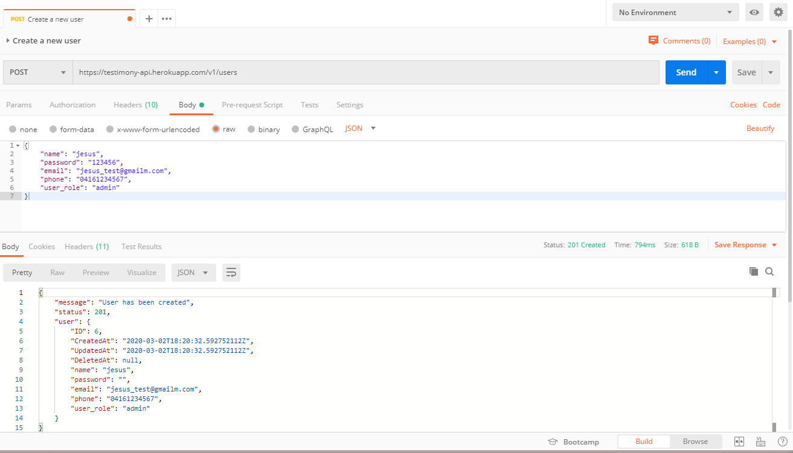

# Testimony API backend

This folder is a API for be used in the testimony project.

 __Versions__: 
#### v1

PostgreSQL database management system

Database Name:  __testimony__

:arrow_down_small: Here you can see the fields that are required or optional in the database. :arrow_down_small:

[Database Link](https://docs.google.com/spreadsheets/d/1gjZ8PnckQj1dV2h4nPFeETNdwAnsOB1Vy-nsPaC4M94/edit?usp=sharing) link.

[How to deploy the API to Heroku - Documentation](documentation/heroku-deploy-documentation/heroku-deploy-documentation.md) link.

For testing you can use the staging version of the API.: __https://raise-the-voices.herokuapp.com/v1/__

Example: Create a new user:

[EndPoint List](documentation/endpoint-list.md) link to endpoint list file.

Note:

#### Details about authorization and authentication (JWT, Limits) in the project at this link: 

[authentication Documentation](documentation/authentication.md)

#### Default user data :warning: (For security you must change the default password):

        Name:     default
        Password: fX2Weey=y?*Z98&N
        Email:    exampleraisethevoices@gmail.com
        Phone:    11111111111
        UserRole: admin