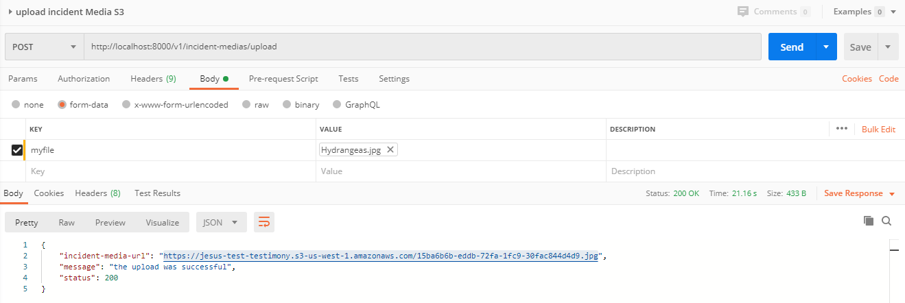

#### #Upload Incident Media File in S3 (AWS)

|URL | `/v1/incident-medias/upload`  |
|:-:|:-:|
|  Method  | Post |
|  Body    | formdata |
|  Type    | File |
|  KEY : myfile  | VALUE: The file |

| Success Response | Code: 200  |
|:-:|:-:|

Content:

        "message": "the upload was successful",
        "status": 200,
        "incident-media-url" = victim-Media-URL

| Error Response | Code: 400  |
|:-:|:-:|

Content:

        "message": "invalid request",
        "status": 400

| Error Response | Code: 500  |
|:-:|:-:|

        "message": "Error! body form-part exceeds the allowed limit",
        "status": 500

| Error Response | Code: 500  |
|:-:|:-:|

        "message": "Error! formatting the file",
        "status": 500

| Error Response | Code: 500  |
|:-:|:-:|

        "message": "Error! The Object exceeds the allowed limit",
        "status": 500

| Error Response | Code: 500  |
|:-:|:-:|

        "message": "Error! Reading the entire object",
        "status": 500

| Error Response | Code: 500  |
|:-:|:-:|

        "message": "Error! It is not a permitted format",
        "status": 500

| Error Response | Code: 500  |
|:-:|:-:|

        "message": "Error! on AWS",
        "status": 500

Notes* :

| allowed formats | "image/jpeg" , "image/jpg", "image/png", "image/gif", "audio/wav", "audio/mp3", "audio/mp4", "audio/mpeg", "video/mpeg", "video/mp4", "video/3gpp"  |
|:-:|:-:|

| maximum file size allowed | 32MB  |
|:-:|:-:| 

Example* :
    