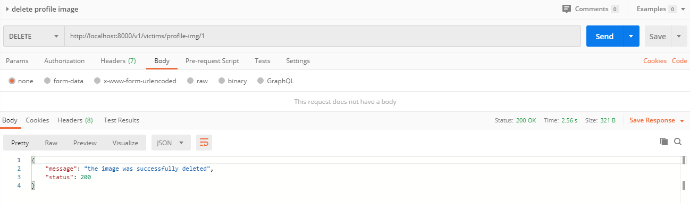

#### #Delete the victim's profile photo according to the victim's ID

|URL | `/v1/victims/profile-img/{idvictim}`  |
|:-:|:-:|
|  Method  |Delete|

|Success Response | Code: 200  |
|:-:|:-:|

Content:

        "message": "the image was successfully deleted",
        "status": 200

| Error Response | Code: 400  |
|:-:|:-:|

Content:

        "message": "Params Error",
        "status": 400

| Error Response | Code: 404  |
|:-:|:-:|

        "message": "victim not found",
        "status": 404

| Error Response | Code: 404  |
|:-:|:-:|

Content:

        "message": "the url field is empty",
        "status": 404

| Error Response | Code: 404  |
|:-:|:-:|

Content:

        "message": "the image is not hosted on our server",
        "status": 404

| Error Response | Code: 404  |
|:-:|:-:|

Content:

        "message": "an error occurred deleting the photo",
        "status": 404 

Example * :
        
